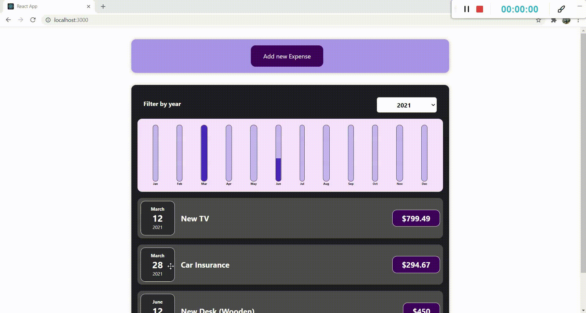

# Expense Tracker - React

This is a react application I have developed as part of my web application portfolio. I have used all the core react features to build it. It has an option to filter out expenses according to year. A new expense can be added using a form but it is temporarily saved as a state. Because of it, added data will reset to its initial state once the page is reloaded. 

### Screenshot

### References

https://reactjs.org/docs/getting-started.html

https://www.udemy.com/course/react-the-complete-guide-incl-redux/